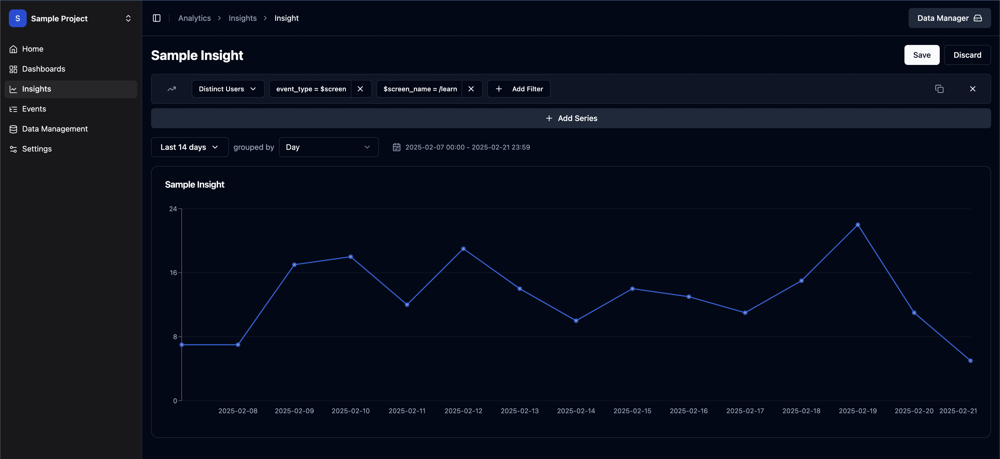
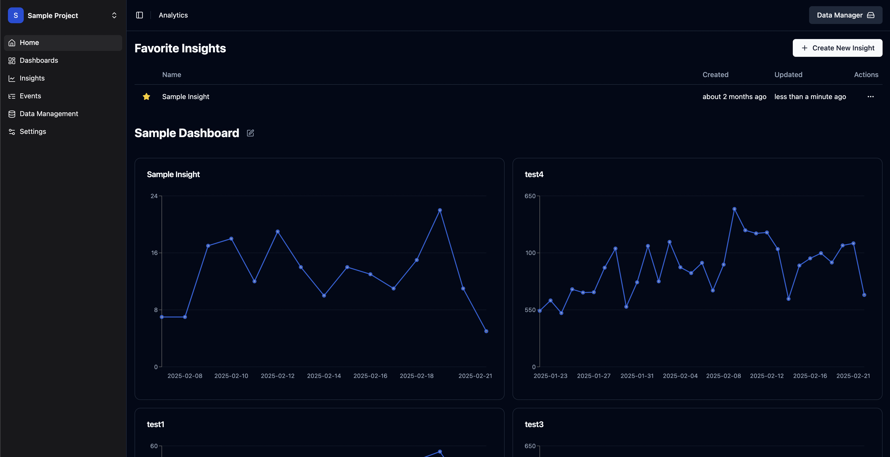

# This is _Quacklytics_ 🦆

_Quacklytics_ is an open-source analytics service built using **DuckDB** and designed to run analytical queries directly inside
your browser. It provides a seamless, lightweight, and high-performance way to process your data without the need for
expensive server-side compute resources.

## Why does this exist?

**Save Resources**: Leverage your existing computers performance by running analytical queries entirely in the browser.  
**Easy to Deploy**: One Binary / Docker Image: No need to install or manage a database. All data is stored in simple files on your filesystem by leveraging sqlite and duckdb.
**Open Source**: Free to use and extend.
**Cheap**: Storage is cheap, compute is expensive. That's why everything is a file and as much work happens inside the browser as possible.

## Getting Started

Currently only deployment via docker is supported. Single binaries will be available at a later stage.

### Preparations (required for both methods)

You must create an empty configuration file called `application.conf` in your working directory.

```shell
touch application.conf
```

This file will be populated with the default config on first start.
If you want to modify the config before that, you can grab
the [default config](backend/config/default.conf) from the git repo.

### Using Docker Compose
```yaml
services:
  quacklytics:
    image: ghcr.io/xz3dev/quacklytics/amd64:latest # arm64 or amd64
    ports:
      - "3001:3000"
    volumes:
      - data:/_data
      - tmp:/_tmp


volumes:
  data:
  tmp:
```

### Using Docker Run

```shell
docker run -d \
  -p 3001:3000 \
  -v data:/_data \
  -v tmp:/_tmp \
  --name quacklytics \
  ghcr.io/xz3dev/quacklytics/amd64:latest
```

## Contributing

We welcome contributions from the community! If you'd like to contribute:

1. Fork the repository.
2. Make your changes.
3. Submit a pull request.

Please make sure to follow our [contribution guidelines](CONTRIBUTING.md).

## License

Quacklytics is licensed under the MIT License. See the [LICENSE](LICENSE) file for details.

## Screenshots




---
```
Happy Quacking! 🦆
```
