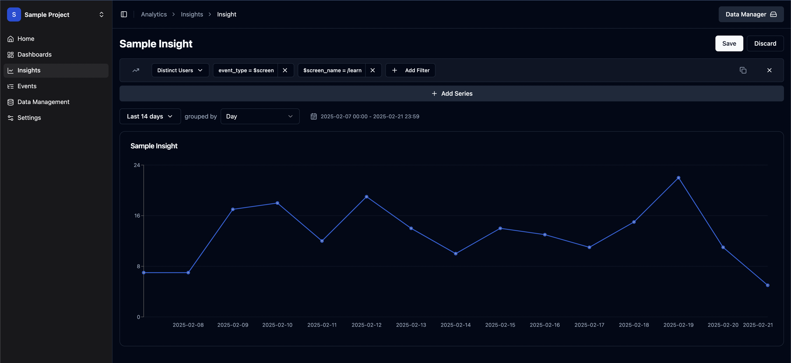
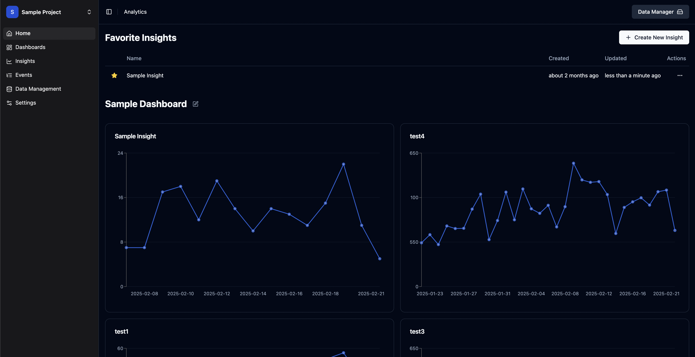

# This is _Quacklytics_ 🦆

_Quacklytics_ is an open-source analytics service built using **DuckDB** and designed to run analytical queries directly inside
your browser. It provides a seamless, lightweight, and high-performance way to process your data without the need for
expensive server-side compute resources.

## Why does this exist?
- Saves server resources by using the client for heavy computations
- Easy to deploy (one binary / docker image).
- Open Source
- Cheap to scale (storage is cheap, usually).

## Getting Started

Currently only deployment via docker is supported. Single binaries will be available at a later stage.

### Preparations (required for both methods)

You must create an empty configuration file called `application.conf` in your working directory.

```shell
touch application.conf
```

This file will be populated with the default config on first start.
If you want to modify the config before that, you can grab
the [default config](backend/config/default.conf) from the git repo.

### Architecture
There are 2 image variants: ARM64 and AMD64. Choose whatever you need depending on your servers architecture:
- `ghcr.io/xz3dev/quacklytics/amd64` for Intel/AMD based CPUs
- `ghcr.io/xz3dev/quacklytics/arm64` for ARM / Apple Silicon based CPUs

### Using Docker Compose
```yaml
services:
  quacklytics:
    image: ghcr.io/xz3dev/quacklytics/amd64:latest # arm64 or amd64
    ports:
      - "3001:3000"
    volumes:
      - data:/_data
      - tmp:/_tmp


volumes:
  data:
  tmp:
```

### Using Docker Run

```shell
docker run -d \
  -p 3001:3000 \
  -v data:/_data \
  -v tmp:/_tmp \
  --name quacklytics \
  ghcr.io/xz3dev/quacklytics/amd64:latest
```

## Sending Data

The **AppendEvent** endpoint allows you to send one event or a batch of events to the server for processing. The API key identifies the project.

### Endpoint URL

```
POST /api/event
```

### Request Format

**Request Headers**

- **Content-Type:** `application/json`
- **X-API-KEY:** `your-api-key`

**Request Body**

The endpoint accepts a single event object or an array of events. The payload should include the following fields:

- **eventType**: The type of event (e.g., `"user_signup"`).
- **sessionId**: Optional session identifier for pseudo-anonymous events.
- **personId**: Optional person identifier. Sending both `sessionId` and `personId` upgrades the session to that person.
- **timestamp** (ISO 8601 datetime): The time when the event occurred.
- **properties**: Event properties stored as JSON and available for querying.
- **personProperties**: Optional person properties. The latest value by event timestamp wins per property.

### Example

```json
{
  "eventType": "user_signup",
  "personId": "person_123",
  "sessionId": "session_abc",
  "timestamp": "2025-02-23T10:00:00Z",
  "properties": {
    "plan": "premium",
    "referrer": "google"
  },
  "personProperties": {
    "email": "test@example.com"
  }
}
```

## Contributing

We welcome contributions from the community! If you'd like to contribute:

1. Fork the repository.
2. Make your changes.
3. Submit a pull request.

Please make sure to follow our [contribution guidelines](CONTRIBUTING.md).

## License

Quacklytics is licensed under the MIT License. See the [LICENSE](LICENSE) file for details.

## Screenshots




---
```
Happy Quacking! 🦆
```
